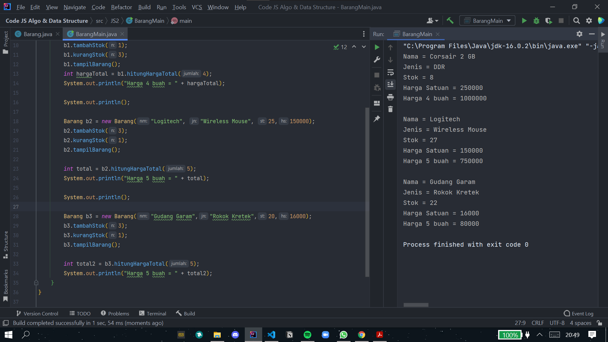
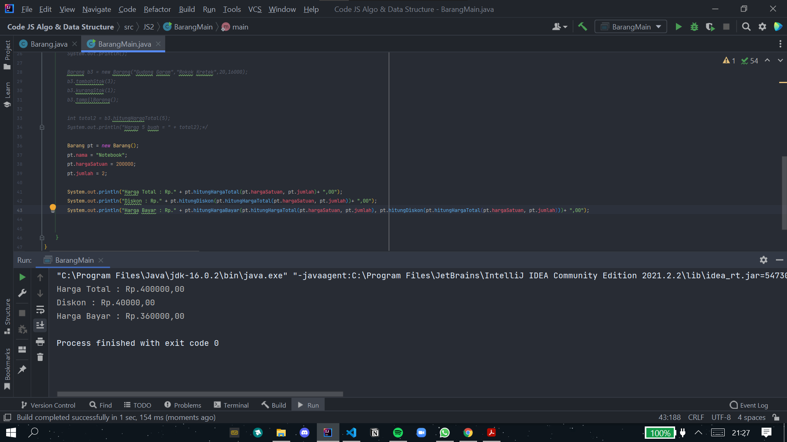
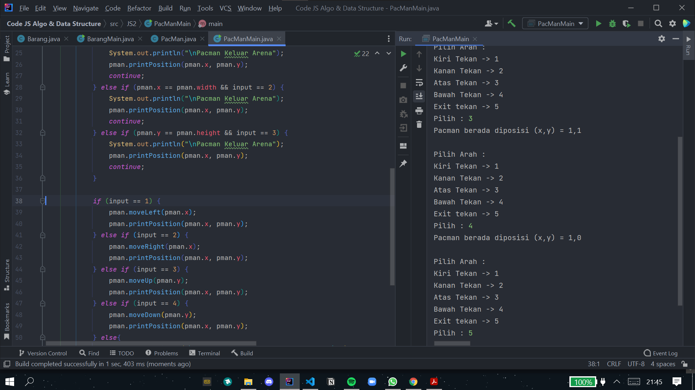

# Laporan & Dokumentasi Praktikum Pertemuan 2
Agung Malik Al Qindy

TI-1G | 01 | 2141720114

# Jawaban Pertanyaan

### Sub Bab 2.2

1. - Karakteristik Class : 

        - Class merupakan tempat untuk membuat objek.
        - Didalam class akan dideklarasikan variabel atau atribut dan method yang dalam istilah prosedural dikenal dengan fungsi atau prosedur.
        - Proses pembuatan objek dari sebuah class disebut dengan instantiation (Instansiasi).

    - Karakteristik Object :

        - Obyek itu memiliki status(state) dan memiliki tingkah laku (Behavior).
        - Status didalam pemrograman itu dikenal dengan istilah atribut atau variabel.
        - Tingkah laku (Behavior) merupakan fungsi atau prosedur yang didalam konsep OOP dikenal dengan method.

2. Kata kunci untuk mendeklarasikan class ialah menggnakan kata kunci **class**.
3. Ada 4 yaitu namaBarang, jenisBarang, stok dan hargaSatuan yang berada di baris ke 13 dan 14.
4. Ada 4 yaitu tampilBarang, tambahStok, kurangiStok dan hitungHargaTotal yang berada di baris ke 16, 23, 27 dan 31.
5. void kurangiStok(int n){ 
   if(n>0){ stok=stok-n; }else{
   }
6. Karena digunakan mengembalikan nilai n.
7. Untuk mengembalikan nilai integer.
8. Tidak ada yang di returnkan.

### Sub Bab 2.2

1. Pada baris ke-15 dan nama objek yang dihasilkan adalah b1.
2. Dengan memanggil nama objek yang telah di instansiasi lalu ketikan atribut atau method.

### Sub Bab 2.4

1. Pada baris ke-18
2. Yang dilakukan ialah instansiasi konstruktor berparameter dengan nama objek baru yaitu b2
3. Barang b3 = new Barang("Gudang Garam","Rokok Kretek",20,16000);
   
   

### Latihan Praktikum

1. 
   
   

2. 
   
   

