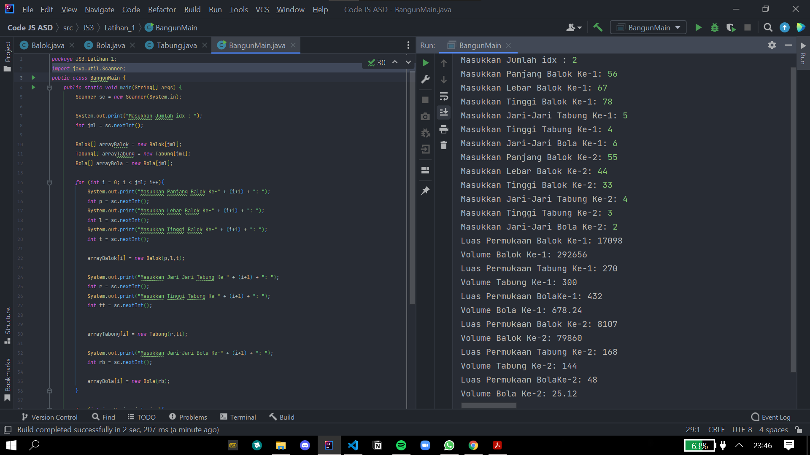
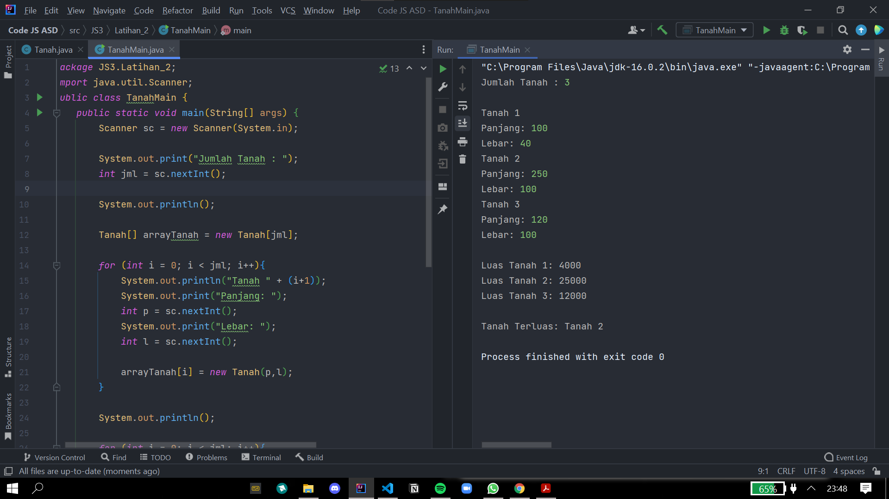
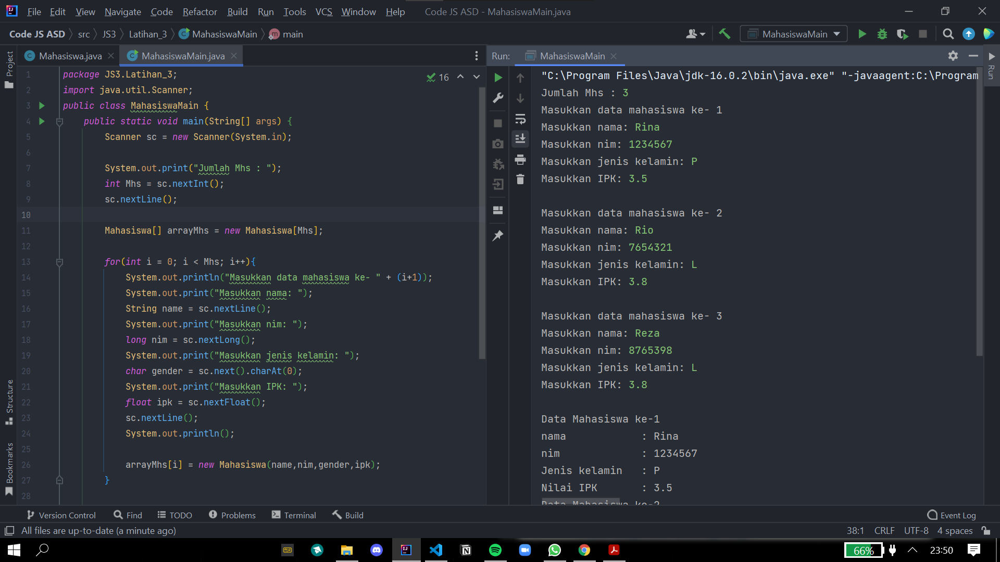
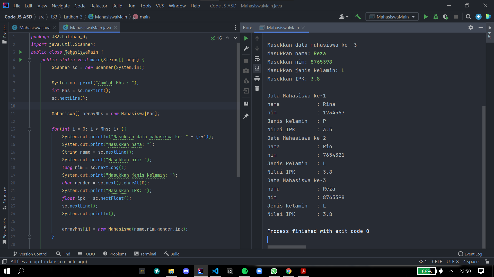

# Laporan & Dokumentasi Praktikum Pertemuan 3

Agung Malik Al Qindy

TI-1G | 01 | 2141720114

# Jawaban Pertanyaan

#### **Pertanyaan 3.2**
1. Tidak harus,karena array of object boleh hanya memliki atribut tidak harus selalu memiliki method.
   
2. Untuk membuat objek PersegiPanjang index array ke 1.
   
3. Mendeklarasikan array ppArray dengan jumlah array 3.
   
4. Kode tersebut adalah array kedua yang dilakukan input.
   
5. Untuk memudahkan mana class dan class main.

#### **Pertanyaan 3.3**
1. Ya bisa
   
2.  ``` java
     koordinat[][] m = new koordinat[5][8];
     k[4][5] = new koordinat();
     ``` 
     

3. Belum ada objek pada index array 5. Seharusnya setelah baris 1 ada baris seperti berikut : 

     ``` java
    pgArray[5] = new Persegi();
    ```  
    
4.  
   ``` java
    System.out.print("Masukkan panjang array : ");
    int arrLength = sc.nextInt();
    PersegiPanjang[] ppArray = new PersegiPanjang[arrLength];
    ```
    
5. Boleh, namun akibatnya program akan menjadi tidak efisien.

#### **Pertanyaan 3.4**
1. Ya bisa

     ``` java
    public class Orang{

        public Orang(int usia, String nama, String alamat){

        }

        public Orang(int no_hp, String pekerjaan){
            
        }
    }
    ```
    
2.  
    ``` java
        public class Segitiga {
            public int alas;
            public int tinggi;

            public Segitiga(int a, int t){
                alas = a;
                tinggi = t;
            }
        }
    ``` 
    
3.  
     ``` java
        public class Segitiga {
            public int alas;
            public int tinggi;

            public Segitiga(int a, int t){
                alas = a;
                tinggi = t;
            }

            double hitungLuas(){
                return 0.5 * alas * tinggi;
            }

            int hitungKeliling(){
                return 3*alas;
            }
        }
     ``` 
    
4. 
     ``` java
        public class SegitigaMain {
            public static void main(String[] args) {
                Segitiga[] sgArray = new Segitiga[4];

                sgArray[0] = new Segitiga(10,4);
                sgArray[1] = new Segitiga(20,10);
                sgArray[2] = new Segitiga(15,6);
                sgArray[3] = new Segitiga(25,10);
            }
        }
     ``` 
        
    
5. 
     ``` java
        public class SegitigaMain {
            public static void main(String[] args) {
                Segitiga[] sgArray = new Segitiga[4];

                sgArray[0] = new Segitiga(10,4);
                sgArray[1] = new Segitiga(20,10);
                sgArray[2] = new Segitiga(15,6);
                sgArray[3] = new Segitiga(25,10);

                for (int i = 0; i < 4 ; i++){
                    System.out.println("Segitiga ke- " + i + "Luas : " + sgArray[i].hitungLuas() + " Keliling : " + sgArray[i].hitungKeliling());
                }
            }
        }
     ``` 

    
#### **Latihan Praktikum 3.5**

1.  

2.  

3.  

