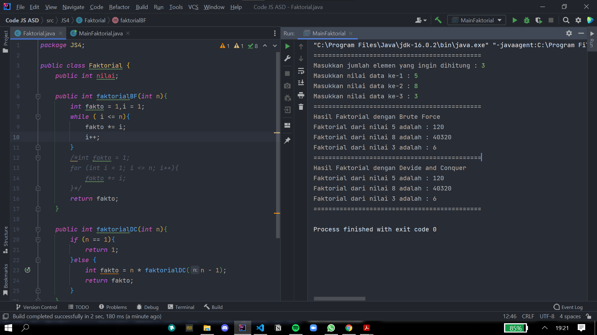
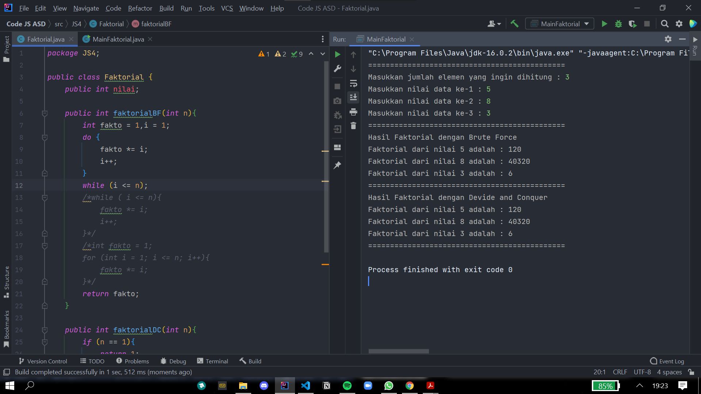
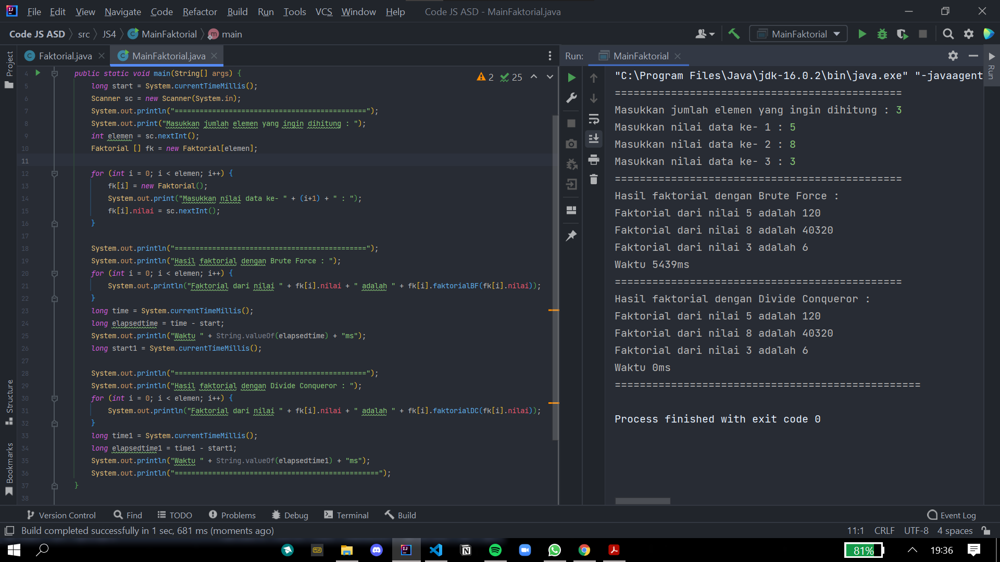
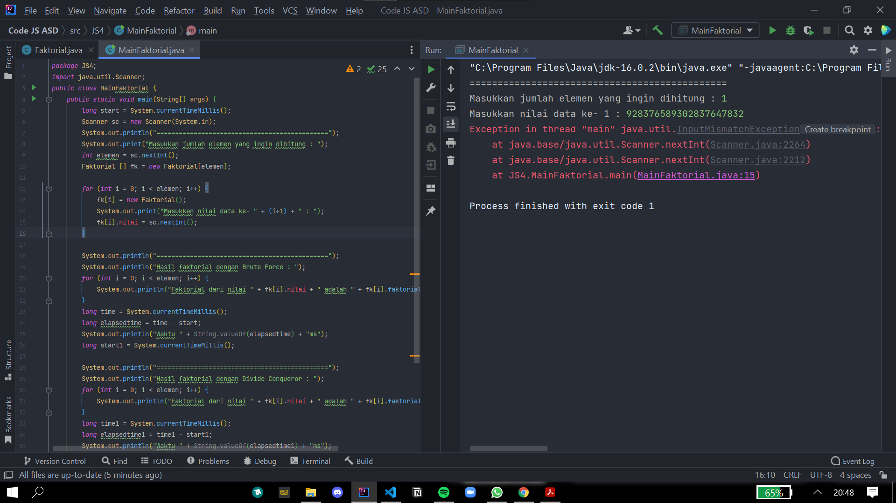
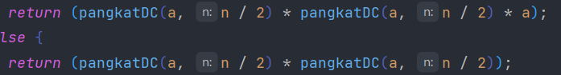
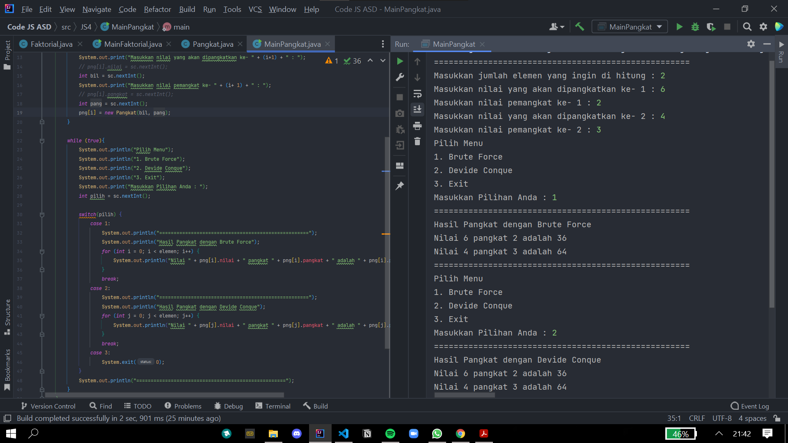
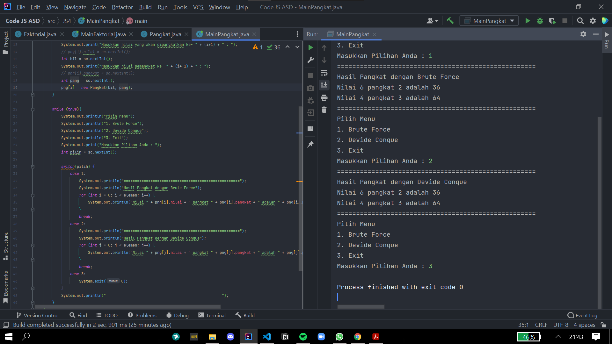
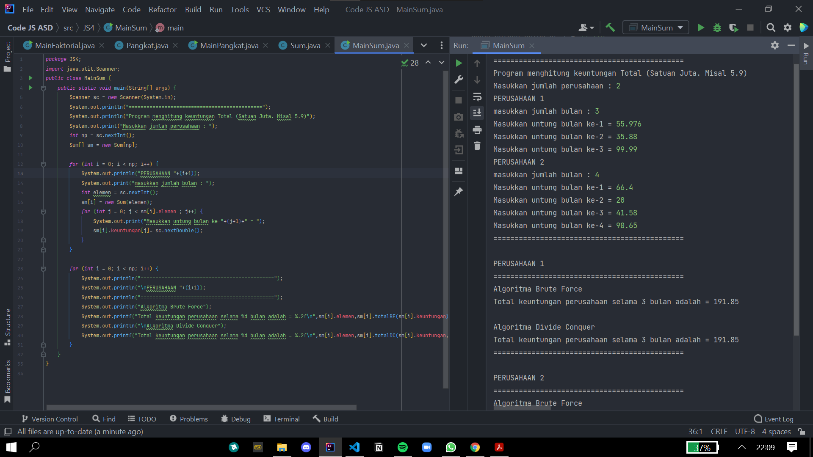
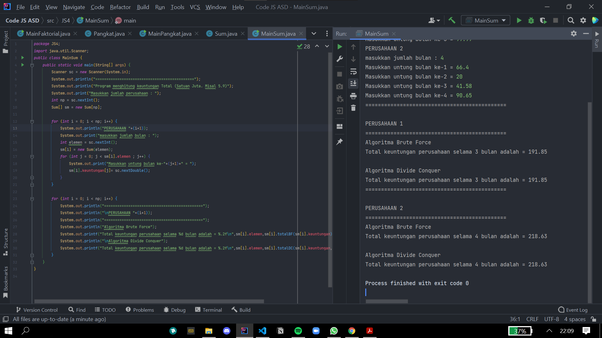
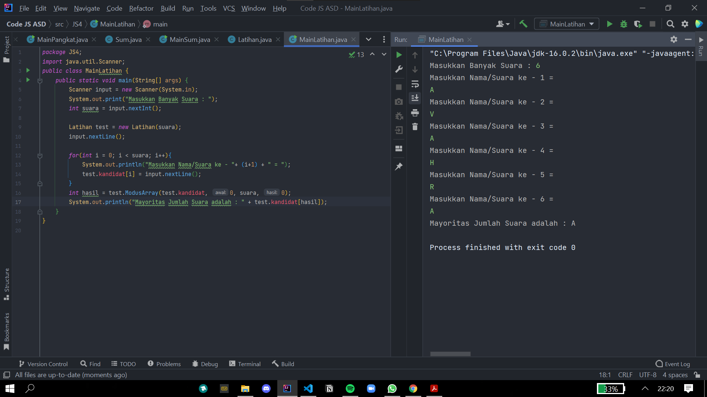

# Laporan & Dokumentasi Praktikum Pertemuan 4

Agung Malik Al Qindy

TI-1G | 01 | 2141720114

# Jawaban Pertanyaan

#### **Pertanyaan 4.2**
1. ``` java
      if (n == 1){
            return 1;
        }
    ```
    Pada kode tersebut bilamana ketika program mencapai kondisi tersebut, maka program akan  mereturnkan nilai 1, sehingga pemanggilan fungsi (rekursif call  dengan parameter yang n-1) akan meghasilkan sebuah return nilai.
2. Ya program tersebut lengkap dengan 3 tahapan,yakni : 
   - Divide = faktorialDC(n-1) pengurangan pada nilai n.
   - Conquer = n*.faktorialDC(n-1) penyelesaian dengan rekursif.
   - Combine = n*faktorialDC(n-1) pengombinasian dengan perkalian.
3. Ya memungkinkan bahkan sangat mungkin
   - 
     
     
   - 
    
     


4. 
   
   

5. Mungkin ada perbedaan waktu pada saat di eksekusi, namun bila melakukan inputan diatas 20 angka maka akan terjadi error yang dimana nilai inputan yang dimasukkan tersebut melebihi range dari integer tersebut.
   
   


#### **Pertanyaan 4.3**
1. Perbedaan dari method PangkatBF() dan PangkatDC yakni pada method pangkatBF() menggunakan fungsi iterative, sedangkan pada method pangkatDC() menggunakan fungsi rekursif.
2. Maksud dari potongan tersebut yakni apabila terdapat suatu bilangan ganjil maka program akan melakukan pembagian terhadap variuable n, yakni dibagi 2 kemudian dikalikan dengan method itu sendiri dan kemudian di kalikan lagi dengan variable a.Namun apabila terdapat suatu bilangan genap maka program akan melakukan return/nilai balik dan di dalam return tersebut dilakukan pembagian terhadap variable n, yang mana variable n di bagi 2 dan kemudian di kalikan dengan method itu sendiri namun tidak dikalikan dengan nilai daripada variable a.
3. Untuk tahap combine sudah terdapat dalam kode tersebut
   
   
4. ``` java
        public class Pangkat {
        public int nilai, pangkat;

        Pangkat(int a, int n) {
            nilai = a;
            pangkat = n;
        }

        public int pangkatBF(int a, int n){
            int hasil = 1;
            for (int i = 0; i < n; i++) {
                hasil = hasil * a;
            }
            return hasil;
        }

        public int pangkatDC(int a, int n){
            if (n == 0) {
                return 1;
            } else {
                if (n % 2 == 1) {
                    return (pangkatDC(a, n / 2) * pangkatDC(a, n / 2) * a);
                } else {
                    return (pangkatDC(a, n / 2) * pangkatDC(a, n / 2));
                }
            }
        }
    }
    ``` 

    ``` java
    public class MainPangkat {
		public static void main(String[] args) {
			Scanner sc = new Scanner(System.in);
			int a,n;
			System.out.println("=======================================");
			System.out.print("Masukkan jumlah elemen yang ingin dihitung : ");
			int elemen = sc.nextInt();
			Pangkat[] png = new Pangkat[elemen];

			for (int i = 0; i <elemen ; i++) { 
				System.out.print("Masukkan nilai yang akan dipangkatkan ke-"+(i+1)+" : ");
				a=sc.nextInt();
				System.out.print("Masukkan nilai pemangkat ke-"+(i+1)+" : ");
				n=sc.nextInt();
				png[i] = new Pangkat(a,n);
			}

			System.out.println("=======================================");
			System.out.println("Hasil Pangkat dengan Brute Force");

			for (int i = 0; i < elemen; i++) {
				System.out.println("Hasil "+png[i].nilai+" pangkat "+png[i].pangkat+" adalah : "+png[i].pangkatBF(png[i].nilai,png[i].pangkat));
			}

			System.out.println("=======================================");
			System.out.println("Hasil Pangkat dengan Divide and Conquer");

			for (int i = 0; i < elemen; i++) {
				System.out.println("Hasil "+png[i].nilai+" pangkat "+png[i].pangkat+" adalah : "+png[i].pangkatDC(png[i].nilai,png[i].pangkat));
			}

			System.out.println("=======================================");
		}
	}
    ``` 

5. 
   

   

#### **Pertanyaan 4.4**
1. - Perbedaan perhitungan yang terjadi pada method TotalBF() yakni, kode program
   terkesan lebih ringkas dan sederhana.

   - Perbedaan perhitungan yang terjadi pada method TotalDC() yakni, kode program lebih panjang daripada kode program pada method TotalBF(),namun method ini memiliki keuntungan yang mana pada method ini kita dapat memecahkan masalah.

2. Dengan cara mengganti syntax println menjadi syntax printf dan juga teknik pembatasan karakter.
3. Return value tersebut berguna untuk mengembalikan nilai dari variable lsum,variable rsum dan juga arr [mid] yang mana masing-masing nya di jumlah kan terlebih dahulu.
4. Di butuhkan variable mid pada method TotalDC() yakni guna menampng nilai dari perhitungan (1+r)/2 yang mana nantinya akan gi gunakan sebagai pengisian nilai pada parameter di method TotalDC().
5. ``` java
    public class Sum {
        public int elemen;
        public double[] keuntungan;
        public double total;

        Sum(int elemen){
            this.elemen = elemen;
            keuntungan = new double[elemen];
            this.total=0;
        }

        double totalBF(double[] arr){
            for (int i = 0; i < elemen ; i++) {
                total = total + arr[i];
            }
            return total;
        }

        double totalDC(double[] arr,int l,int r) {
            if (l == r) {
                return arr[l];
            } else if (l < r) {
                int mid = (l + r) / 2;
                double lsum = totalDC(arr, l, mid - 1);
                double rsum = totalDC(arr, mid + 1, r);
                return lsum + rsum + arr[mid];
            }
            return 0;
        }
    }
    ``` 

    ``` java
    import java.util.Scanner;
    public class MainSum {
        public static void main(String[] args) {
            Scanner sc = new Scanner(System.in);
            System.out.println("=============================================");
            System.out.println("Program menghitung keuntungan Total (Satuan Juta. Misal 5.9)");
            System.out.print("Masukkan jumlah perusahaan : ");
            int np = sc.nextInt();
            Sum[] sm = new Sum[np];

            for (int i = 0; i < np; i++) {
                System.out.println("PERUSAHAAN "+(i+1));
                System.out.print("masukkan jumlah bulan : ");
                int elemen = sc.nextInt();
                sm[i] = new Sum(elemen);
                for (int j = 0; j < sm[i].elemen ; j++) {
                    System.out.print("Masukkan untung bulan ke-"+(j+1)+" = ");
                    sm[i].keuntungan[j]= sc.nextDouble();
                }
            }

            for (int i = 0; i < np; i++) {
                System.out.println("=============================================");
                System.out.println("\nPERUSAHAAN "+(i+1));
                System.out.println("=============================================");
                System.out.println("Algoritma Brute Force");
                System.out.printf("Total keuntungan perusahaan selama %d bulan adalah = %.2f\n",sm[i].elemen,sm[i].totalBF(sm[i].keuntungan));
                System.out.println("\nAlgoritma Divide Conquer");
                System.out.printf("Total keuntungan perusahaan selama %d bulan adalah = %.2f\n",sm[i].elemen,sm[i].totalDC(sm[i].keuntungan,0 , sm[i].elemen-1));
            }
        }
    }
    ``` 
    

    

#### **Latihan**


