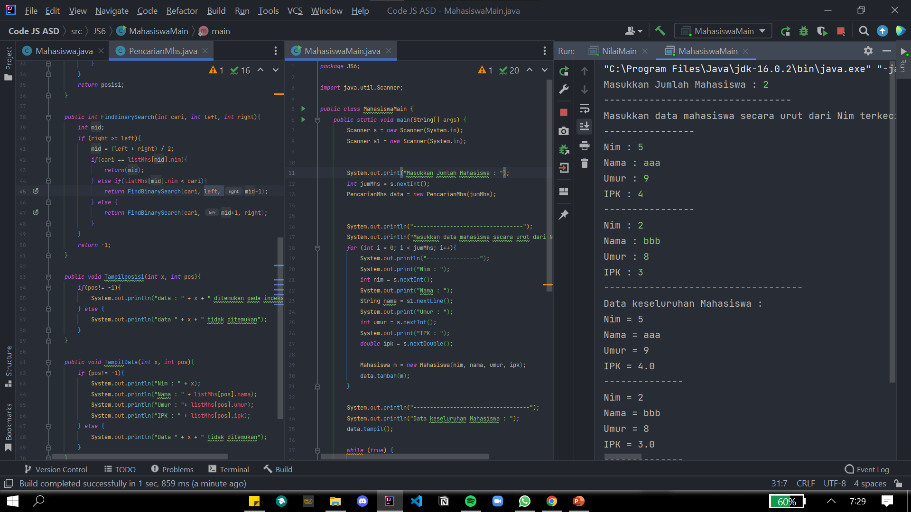
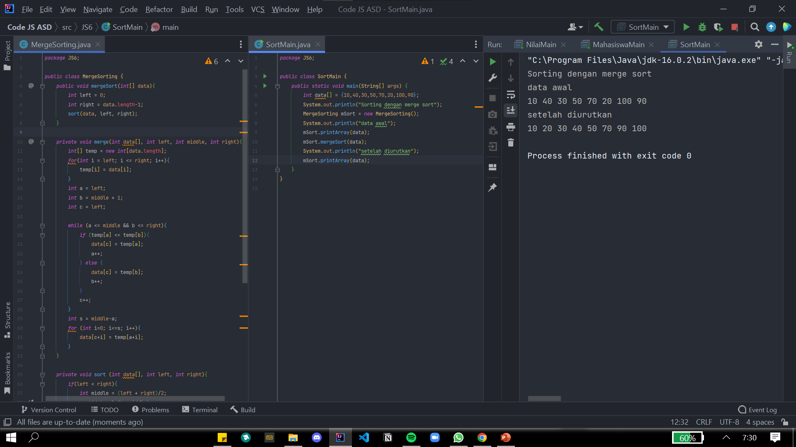
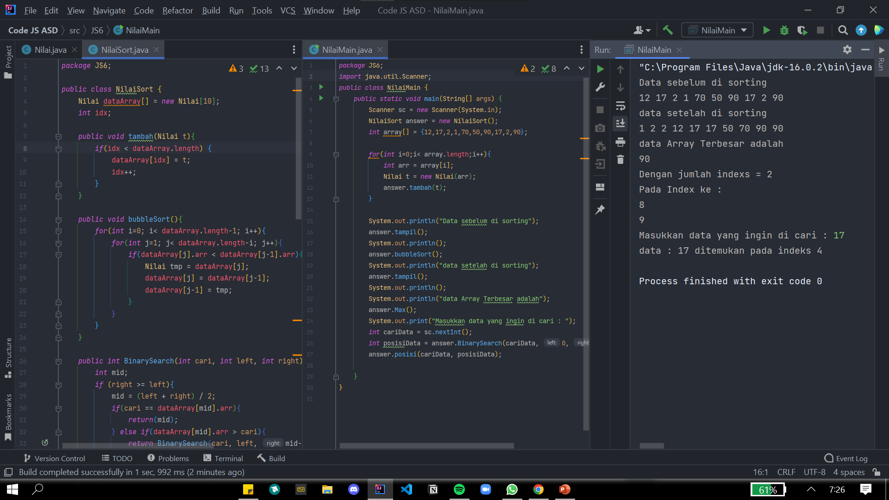

# Laporan & Dokumentasi Praktikum Pertemuan 7

Agung Malik Al Qindy

TI-1G | 01 | 2141720114

# Jawaban Pertanyaan

#### **Pertanyaan 6.2**
1. 
   - Method TampilData berfungsi untuk menampilkan semua data mahasiswa seperti umur,nama,umur,ipk apabila nilai dari variabel pos tersebut tidak sama dengan -1 atau variabel dari posisi
   
   - Sedangkan Method dari TampilPosisi tersebut sama seperti Method TampilData namun di didalam Method tersebut menampilkan posisi data di dalam array apabila nilai dari variabel pos tersebut tidak sama dengan -1 atau variabel dari posisi

2. Fungsi dari break tersebut yaitu untuk menghentikan atau keluar dari perulangan bilamana data yang dicari itu sama
   
3. Program masih dapat berjalan serta hasil yang dikeluarkan benar,mengapa demikian? ini dikarenakan metode sequential search ialah membandingkan data yang dicari secara berurutan sampai data tersebut ditemukan yang dimana tidak perlu melakukan pengurutan seperti binary search

#### **Pertanyaan 6.3**
1. ```java
    if (right >= left){
            mid = (left + right) / 2;
    ```

2. ```java
   if(cari == listMhs[mid].nim){
                return(mid);
            } else if(listMhs[mid].nim > cari){
                return FindBinarySearch(cari, left, mid-1);
            } else {
                return FindBinarySearch(cari, mid+1, right);
            }
    ```

3. Apabila data nim tidak diurutkan maka yang terjadi ialah porgram akan error ini dikerenakan pada metode binary search data akan diambil dari posisi awal dan akhir yang kemudian akan dibagi menjadi 2
4. Tidak sesusai,
   ```java
   int mid;
        if (right >= left){
            mid = (left + right) / 2;
            if(cari == listMhs[mid].nim){
                return(mid);
            } else if(listMhs[mid].nim < cari){
                return FindBinarySearch(cari, left, mid-1);
            } else {
                return FindBinarySearch(cari, mid+1, right);
            }
        }
        return -1;
    ```

5. 
    - Pada class PencarianMhs ditambahkan kode berikut : 
    ```java
    Mahasiswa listMhs[];
    int idx;

    PencarianMhs(int jumMhs){
        listMhs = new Mahasiswa[jumMhs];
    }
    ```

    - Dan juga pada class MahasiswaMain juga ditambahkan kode berikut :
    ```java
    System.out.println("Masukkan Jumlah Mahasiswa");
        int jumMhs = s.nextInt();
        PencarianMhs data = new PencarianMhs(jumMhs);
    ```

    - Output
    

#### **Pertanyaan 6.4**



#### **Latihan Praktikum**

